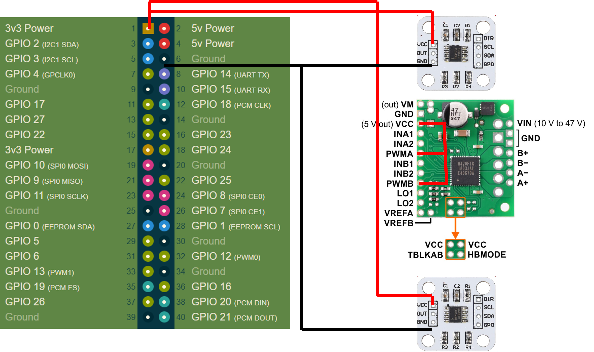

# UND_EDUBot Overview

[Build Instructions Playlist](https://www.youtube.com/playlist?list=PLYcNE-BB9RCs-w1YGQMMMpfctwIbQ31T8)

# Build the robot

Use the parts list spreadsheet to purchase the components needed to build the robot.

If you are building multiple robots with a group, multi-packs of screws and wire can be shared across builds.

<!-- Add a link to hosted CAD resources here if they become available online. -->

Use the wiring diagram when soldering and assembling the electrical components.



## Tools Needed

- 3D printer
- Soldering iron & solder
- Metric hex key set
- Small flat head screwdriver
- Small pliers

# Build Instructions

Build instructions are provided in the YouTube playlist above. Follow the videos and diagrams to assemble the robot.

# Getting the robot running

Install Pixi using the [official Pixi installation guide](https://pixi.prefix.dev/latest/installation).

Enter the ROS 2 environment
```bash
pixi shell
```

Build the workspace
```bash
colcon build --symlink-install
source install/setup.zsh
```

Build one package
```bash
colcon build --symlink-install --packages-select PiBot
source install/setup.zsh
```

Run a node manually
```bash
ros2 run PiBot motor_control
```

Run the PiBot launch file
```bash
ros2 launch PiBot PiBot_launch.py
```

## macOS development note

The `sllidar_ros2` package is skipped on macOS. It is the hardware driver for the Slamtec/RPLIDAR sensor, and this workspace does not currently build or run that driver reliably on macOS. When `activate.sh` is sourced on macOS, it writes `sllidar_ros2/COLCON_IGNORE` so `colcon` ignores the package. On non-macOS systems, the activation script removes only the `COLCON_IGNORE` file that it generated, allowing the package to build normally.

To hide local status noise from the `sllidar_ros2` submodule
```bash
git config submodule.sllidar_ros2.ignore dirty
```
